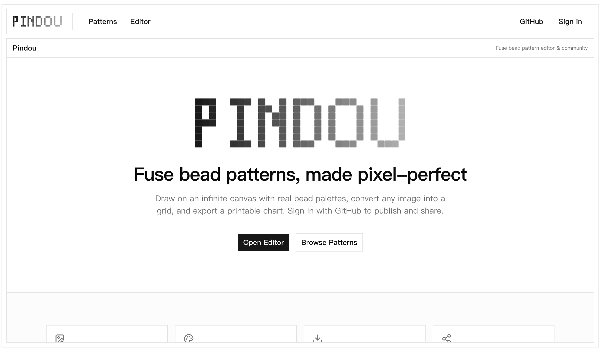

<p align="center">
  
</p>
<p align="center">Fuse bead pattern editor and community.</p>
<p align="center">
  <a href="https://github.com/xingxingmofashu/pindou/actions/workflows/ci.yml"></a>
  <a href="https://github.com/xingxingmofashu/pindou"></a>
  <a href="https://github.com/xingxingmofashu/pindou"></a>
</p>

<p align="center">
  <a href="README.md">English</a> |
  <a href="README.zh.md">简体中文</a>
</p>

---

Create pixel-art patterns, sign in with GitHub, and share them with the world.

**Live:** [xingxing-pindou.vercel.app](https://xingxing-pindou.vercel.app) (Vercel) · [xingxing-pindou.netlify.app](https://xingxing-pindou.netlify.app) (Netlify — accessible from mainland China)

<p align="center">
  
</p>

## Features

- **Canvas editor** — WebGL-powered (PixiJS v8) with an infinite sparse grid, cursor-centred zoom, pan, and pen / eraser / fill tools
- **Fixed grid resolution** — grid lines and beads always render at data-cell resolution, so an imported pattern keeps its exact cell count at any zoom (LOD only controls paint-brush block size)
- **Image to pattern** — convert any image into a bead pattern in your browser (Web Worker + canvas, perceptual OKLab colour matching); Photo / Illustration modes, merge similar colours, remove background, and exclude specific colours from the conversion
- **Live bead usage** — the editor shows the painted grid size, total beads, and per-colour counts that update as you draw
- **Export PNG chart** — download the pattern as a printable chart with coordinates, optional colour-code labels, and a scaled bead-usage list
- **Multi-brand palettes** — MARD (漫漫), Perler, Hama, Artkal with switchable series
- **GitHub sign-in** — publish patterns with your GitHub identity (Better Auth), no separate account or username needed
- **Pattern gallery** — browse recently published patterns with thumbnail previews
- **Detail view** — interactive read-only canvas on each pattern page, editable by the author

## Tech Stack

| | |
|---|---|
| Framework | Next.js 16 (App Router) |
| Canvas | PixiJS v8 (WebGL) |
| Styling | Tailwind CSS v4 + shadcn/ui (Base UI) |
| Database | PostgreSQL (Neon) via @neondatabase/serverless + Drizzle ORM |
| Auth | Better Auth (GitHub OAuth) |
| Image conversion | In-browser (Web Worker + canvas, perceptual OKLab) |
| Thumbnails | sharp (server-side, Node runtime) |
| Color math | culori |
| Rate limiting | Upstash Redis (@upstash/ratelimit) |
| Language | TypeScript (strict) |

## Getting Started

```bash
# Install dependencies
pnpm install

# Start dev server (http://localhost:3000)
pnpm dev

# Production build
pnpm build

# Lint
pnpm lint
```

## Project Structure

```
src/
  app/                  # Next.js App Router routes — server pages fetch data and render a
                        # client.tsx content component, each route with loading.tsx (skeleton)
                        # and error.tsx (error boundary)
    [lang]/             # Locale-prefixed routes (en / zh)
      (site)/           # Main site layout (header + footer chrome)
        (content)/      # Home + pattern gallery + pattern detail
          patterns/     # Gallery: page.tsx (server) + client.tsx + loading.tsx + error.tsx
          patterns/[id]/# Detail: page.tsx (server) + client.tsx + loading.tsx + error.tsx
        (workspace)/    # Editor + pattern edit pages
          editor/       # Editor: page.tsx (client canvas) + loading.tsx + error.tsx
          patterns/[id]/edit/ # Edit: page.tsx (server) + client.tsx + loading.tsx + error.tsx
      sign-in/          # GitHub sign-in page
    api/auth/[...all]/  # Better Auth route handlers
    api/patterns/       # REST API (GET list, POST publish)
    api/patterns/[id]/  # GET single pattern, PATCH update
    api/brands/         # GET palette catalog (all brands + colors)
    api/brands/[id]/    # GET one brand + colors
  components/
    auth-nav.tsx        # Header auth area (sign-in link / user menu)
    github-button.tsx   # GitHub OAuth sign-in button
    header.tsx          # Site header (server component)
    footer.tsx          # Site footer
    logo.tsx            # Brand logo
    pixi-canvas.tsx     # Reusable PixiJS canvas component
    color-palette.tsx   # Brand palette sidebar panel
    bead-stats.tsx      # Live bead-usage panel
    zoom-controls.tsx   # Zoom in / out / fit controls
    dialogs/            # publish-dialog.tsx, import-dialog.tsx, export-dialog.tsx
    icon/               # GitHub icon
    providers/          # SWR + web-vitals providers
    ui/                 # shadcn/ui components (never edited manually)
  hooks/
    use-palette.ts      # Shared active-brand store (Zustand)
    use-editor.ts       # Editor page state (tool, colour, panels, zoom, dialogs)
    use-edit.ts         # Pattern edit page state (draft fields, panels, saving)
    use-pattern.ts      # Pattern detail read-only state (canvas api + zoom + panels)
    use-shortcuts.ts    # B/E/G tool-switching keybindings
    use-pixi-app.ts     # PixiJS Application lifecycle (WebGL context management)
    use-pixi-canvas.ts  # Zoom/pan/draw pointer events, fixed-resolution rebuild
  workers/
    transform.worker.ts # In-browser image decode + pre-scale (createImageBitmap/OffscreenCanvas)
  lib/
    auth/               # Better Auth: server.ts (config) + client.ts
    editor.ts           # Pure functions: grid math, LOD, flood fill, serialization, counting
    constants.ts        # Shared limits: grid dimensions, upload/body caps, zoom, page size
    date.ts             # Localized date formatting (date-fns, relative + absolute)
    export.ts           # Client-only PNG chart export (never on the server)
    transform.ts        # Pure image→grid quantization (perceptual OKLab), shared by the import worker
    thumbnail.ts        # Node-only thumbnail rendering (sharp)
    grid-storage.ts     # R2 grid JSON storage (versioned keys)
    r2.ts               # Generic Cloudflare R2 client (grids + thumbnails, Node-only)
    rate-limit.ts       # Upstash sliding-window rate limiter
    server/             # Server-only data access: palettes.ts, patterns.ts (cached), meta.ts
    utils.ts            # Shared helpers
  db/                   # Drizzle schema (auth + app tables) + Neon connection
```

## Editor

The editor at `/editor` provides:

- **Pen / Eraser / Fill** — paint with the active colour (Bresenham-interpolated drags), erase beads, or flood-fill connected regions
- **Undo / Redo** — step back through your edits (⌘Z / ⇧⌘Z; Ctrl+Z / Ctrl+Shift+Z / Ctrl+Y on Windows/Linux)
- **Show colour codes** — toggle per-bead colour-code labels on the canvas
- **Import from image** — upload an image and convert it into a bead pattern; advanced options include Photo / Illustration modes, merge similar colours, remove background, and excluding colours from the palette
- **Export PNG** — download a printable chart with coordinates, optional colour-code labels, and a bead-usage list
- **Bead usage panel** — a right sidebar showing grid size, total beads, and per-colour counts, updating live as you draw
- **Zoom** — wheel zoom (cursor-centred, 0.5×–20×), percentage input, fit button
- **Pan** — middle- or right-button drag
- **Palette sidebar** — brand switcher, swatches grouped by series
- **Publish** — sign in with GitHub and save the pattern to the gallery with a title and description; your author name comes from your GitHub account

## API

| Method | Route | Description |
|---|---|---|
| `GET` | `/api/patterns?page=1` | List published patterns (paginated) |
| `POST` | `/api/patterns` | Publish a new pattern (GitHub sign-in required, rate limited) |
| `GET` | `/api/patterns/[id]` | Get a single pattern |
| `PATCH` | `/api/patterns/[id]` | Update a pattern's title, description, or grid (author only, rate limited) |
| `GET` | `/api/brands` | List all brands with their colors |
| `GET` | `/api/brands/[id]` | Get a single brand with its colors |

Image-to-pattern conversion happens entirely in the browser (no `/api/transform`); the uploaded image never leaves the client. Publish/edit JSON bodies are capped at 20 MB; grids are bounded to 4096 per side and 1,000,000 total cells. Publish and edit are rate-limited per user (20 requests / 60 s) via Upstash Redis.

## License

[Apache License 2.0](LICENSE)
