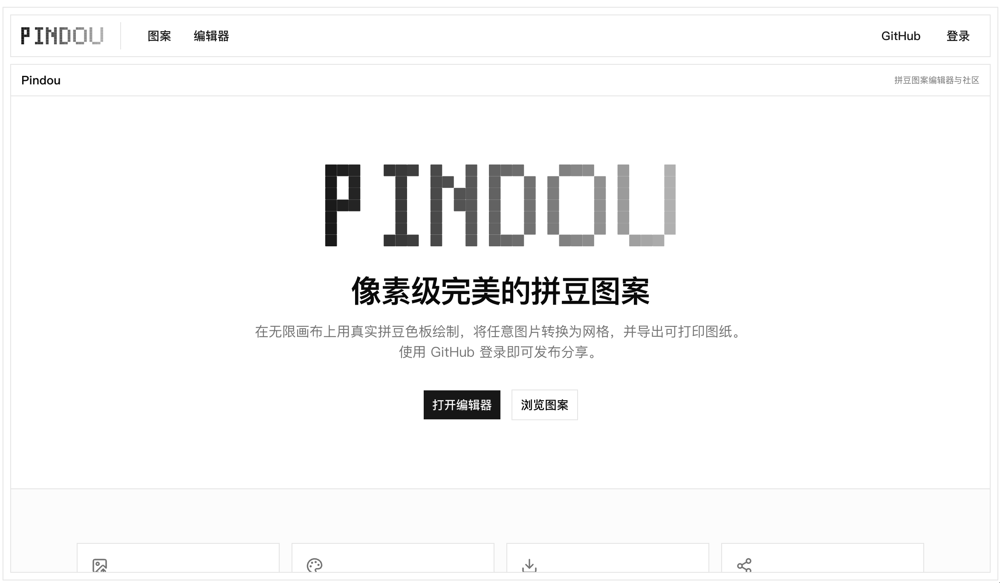

<p align="center">
  
</p>
<p align="center">拼豆图纸编辑器与分享社区。</p>
<p align="center">
  <a href="https://github.com/xingxingmofashu/pindou/actions/workflows/ci.yml"></a>
  <a href="https://github.com/xingxingmofashu/pindou"></a>
  <a href="https://github.com/xingxingmofashu/pindou"></a>
</p>

<p align="center">
  <a href="README.md">English</a> |
  <a href="README.zh.md">简体中文</a>
</p>

---

创建像素风格的拼豆图纸，使用 GitHub 登录，与世界分享你的设计。

**线上地址：** [xingxing-pindou.vercel.app](https://xingxing-pindou.vercel.app)（Vercel）· [xingxing-pindou.netlify.app](https://xingxing-pindou.netlify.app)（Netlify，中国大陆可访问）

<p align="center">
  
</p>

## 功能

- **画布编辑器** — 基于 WebGL (PixiJS v8)，无限稀疏网格，以光标为中心的缩放、平移，以及画笔 / 橡皮擦 / 油漆桶工具
- **固定网格分辨率** — 网格线和豆子始终按数据格分辨率渲染，导入的图纸在任意缩放级别下格子数量保持不变（LOD 仅控制画笔块大小）
- **图片转图纸** — 将任意图片转换为拼豆图纸，使用当前品牌色号（服务端 sharp + OKLab 感知色差匹配）；支持照片 / 插画模式、合并相近颜色、移除背景，以及排除指定色号
- **实时珠子用量** — 编辑器右侧面板实时显示已绘制的尺寸、珠子总数和每种色号的数量
- **导出 PNG 图纸** — 下载带坐标的打印图纸，可选色号标签和随珠尺寸缩放的用量列表
- **多品牌色号** — 内置 MARD（漫漫）、Perler、Hama、Artkal 色号库，可自由切换品牌
- **GitHub 登录** — 使用 GitHub 身份发布图纸（Better Auth），无需单独注册账号或填写用户名
- **图纸画廊** — 浏览最新发布的图纸，带缩略图预览
- **详情页** — 每张图纸都有只读交互式画布，作者可进入编辑

## 技术栈

| | |
|---|---|
| 框架 | Next.js 16 (App Router) |
| 画布 | PixiJS v8 (WebGL) |
| 样式 | Tailwind CSS v4 + shadcn/ui (Base UI) |
| 数据库 | PostgreSQL (Neon) via @neondatabase/serverless + Drizzle ORM |
| 认证 | Better Auth (GitHub OAuth) |
| 图片转换 | sharp（服务端，Node runtime） |
| 色彩计算 | culori |
| 限流 | Upstash Redis (@upstash/ratelimit) |
| 语言 | TypeScript (strict) |

## 快速开始

```bash
# 安装依赖
pnpm install

# 启动开发服务器 (http://localhost:3000)
pnpm dev

# 生产构建
pnpm build

# 代码检查
pnpm lint
```

## 项目结构

```
src/
  app/                  # Next.js App Router 页面
    [lang]/             # 带语言前缀的路由（en / zh）
      (site)/           # 站点主布局（页头 + 页脚外壳）
        editor/         # 编辑器页面
        patterns/       # 图纸画廊
        patterns/[id]/  # 图纸详情与编辑页面
      sign-in/          # GitHub 登录页
    api/auth/           # Better Auth 路由处理
    api/patterns/       # REST API（GET 列表、POST 发布）
    api/patterns/[id]/  # GET 单张图纸、PATCH 更新
    api/transform/      # POST 图片 → 图纸转换（Node runtime）
    api/brands/         # GET 色号目录（所有品牌及色号）
  components/
    auth/               # GitHubButton、UserMenu（登录 UI）
    editor/             # 工具栏、缩放控件、色号面板、各弹窗、珠子用量面板
    pattern/            # 图纸卡片、详情面板
    pixi-canvas.tsx     # 可复用 PixiJS 画布组件
    ui/                 # shadcn/ui 组件（禁止手动修改）
  hooks/
    use-palette.ts      # 共享当前品牌 store（Zustand）
    use-pixi-app.ts     # PixiJS Application 生命周期（WebGL 上下文管理）
    use-pixi-canvas.ts  # 缩放/平移/绘制指针事件、固定分辨率重建
  lib/
    auth/               # Better Auth：server.ts（配置）+ client.ts
    editor.ts           # 纯函数：网格计算、LOD、油漆桶、序列化、计数
    export.ts           # 仅客户端：PNG 图纸导出（禁止在服务端运行）
    transform.ts        # 仅 Node：图片 → 图纸（sharp + OKLab）
    thumbnail.ts        # 仅 Node：缩略图渲染（sharp）
    grid-storage.ts     # R2 网格 JSON 存储（版本化键）
    r2.ts               # 通用 Cloudflare R2 客户端（网格 + 缩略图，仅 Node）
    rate-limit.ts       # Upstash 滑动窗口限流器
    server/             # 仅服务端数据访问：palettes.ts、patterns.ts（带缓存）、meta.ts
    utils.ts            # 通用工具函数
  db/                   # Drizzle schema（认证 + 应用表）+ Neon 连接
```

## 编辑器

访问 `/editor` 使用编辑器，功能包括：

- **画笔 / 橡皮擦 / 油漆桶** — 使用当前颜色绘制（拖拽时通过 Bresenham 算法插值，防止断线）、擦除豆子、或对连通区域进行填充
- **撤销 / 重做** — 逐步回退编辑操作（⌘Z / ⇧⌘Z；Windows/Linux 为 Ctrl+Z / Ctrl+Shift+Z / Ctrl+Y）
- **显示色号** — 在画布上切换显示每颗豆子的色号标签
- **图片导入** — 上传图片并转换为拼豆图纸；高级选项包括照片 / 插画模式、合并相近颜色、移除背景，以及从色板中排除指定色号
- **导出 PNG** — 下载带坐标的打印图纸，可选色号标签和珠子用量列表
- **珠子用量面板** — 右侧边栏显示图纸尺寸、珠子总数和每种色号数量，随绘制实时更新
- **缩放** — 滚轮缩放（以光标为中心，0.5×–20×）、百分比输入、适应画布按钮
- **平移** — 鼠标中键或右键拖拽
- **色号面板** — 左侧边栏，品牌切换器，按系列分组的色块
- **发布** — 使用 GitHub 登录后将图纸保存到画廊，可填写标题和描述；署名自动取自你的 GitHub 账号

## API

| 方法 | 路由 | 说明 |
|---|---|---|
| `GET` | `/api/patterns?page=1` | 分页获取已发布图纸列表 |
| `POST` | `/api/patterns` | 发布新图纸（需 GitHub 登录） |
| `GET` | `/api/patterns/[id]` | 获取单张图纸 |
| `PATCH` | `/api/patterns/[id]` | 更新图纸的标题、描述或网格（仅作者） |
| `POST` | `/api/transform` | 将图片转换为图纸（multipart `file`、`width`、`brandCode`；可选 `mode`、`mergeSimilarity`、`removeBackground`、`excludedCodes`） |
| `GET` | `/api/brands` | 获取所有品牌及其色号 |
| `GET` | `/api/brands/[id]` | 获取单个品牌及其色号 |

请求限制：`/api/transform` 上传上限 10 MB，源图片上限 4000 万像素；发布/编辑的 JSON 请求体上限 20 MB。网格限制为每边 4096 格、总格数 100 万。`/api/transform` 另有按 IP 限流（20 次 / 60 秒），基于 Upstash Redis。

## 开源协议

[Apache License 2.0](LICENSE)
